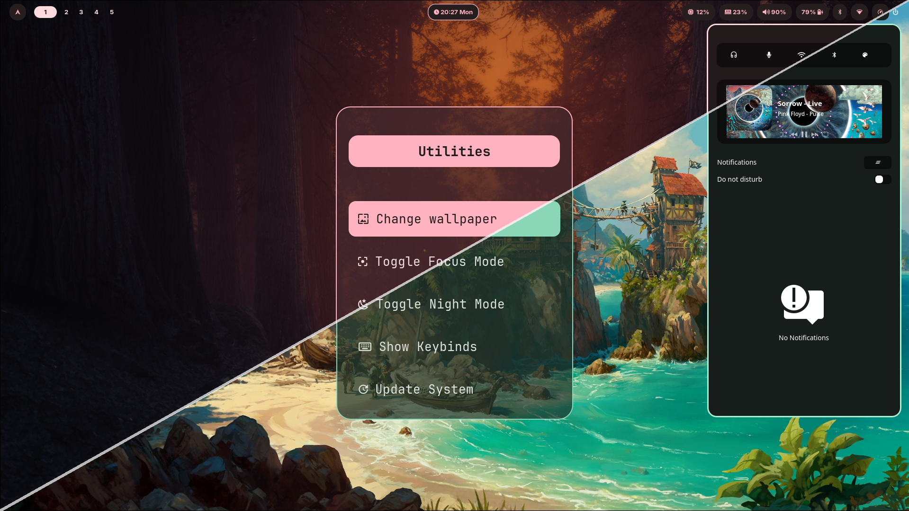
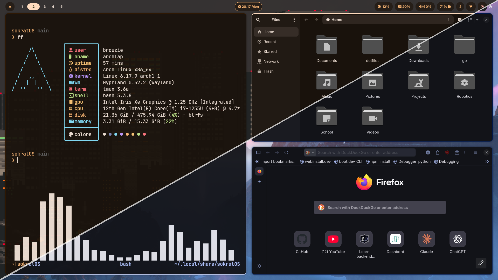
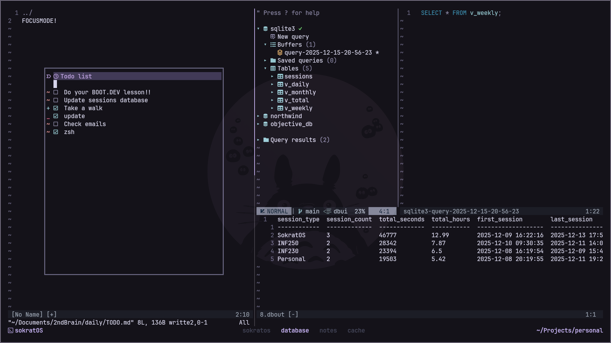

# sokratOS

> An opinionated Arch Linux + Hyprland environment built for productivity, aesthetics, and Vim-style navigation.

**sokratOS** is a curated dotfiles and configuration system for Arch Linux centered around the **Hyprland** Wayland compositor. It aims to provide a cohesive, efficient desktop environment with strong keyboard-driven workflows, dynamic theming, and a carefully selected toolchain for development and daily use.

This is **not** a general-purpose Linux setup — it reflects specific opinions about how a desktop *should* feel and behave.

---

## ⚠️ Vim-Centric Workflow

> **sokratOS** assumes familiarity with *vim-motions*

Most menus, launchers, window navigation, and custom keybindings rely heavily on:

- `hjkl` for movement
- `Ctrl + p / Ctrl + n` for selection

If you’re new to Vim motions, it’s highly recommended to run:

```bash
vimtutor
```

## ✨ Features

- 🎨 **Dynamic Theming**: Automatic color scheme generation from wallpapers using `matugen` and `pywal`
- 🖥️ **Hyprland Compositor**: Modern Wayland compositor with beautiful animations and tiling
- 🛠️ **Custom Utility Scripts**: Theme switching, focus mode, screen recording, and more
- 🔧 **Development Ready**: Docker, development tools, and Neovim configuration included
- 📱 **Modern UI Components**: Waybar, Rofi, SwayNC for notifications and menus

## 📸 Preview







## 🚀 Quick Start

### Installation example

https://github.com/user-attachments/assets/d63283af-eb93-4078-8bd3-a0ec6c1d6c99

### Prerequisites

- Install Arch
- Internet connection
- Go through a base archinstall

### Installation

**From a fresh archinstall**:

1. Clone the repository and run the installer:
   ```bash
   sudo pacman -S git --needed
   git clone https://github.com/BrouZie/sokratOS.git ~/.local/share/sokratOS
   bash ~/.local/share/Sokratos/install.sh
   ```

> [!NOTE]
> Visit the **[Installation Guide](docs/01-getting-started/installation-arch.md)** if you are struggling with the installation steps

### Post-installation

1. Configure your monitor settings:
    ```bash
    nvim ~/.config/hypr/configs/monitors.conf
    ```
2. [Install pywalfox](https://addons.mozilla.org/en-US/firefox/addon/pywalfox/)
3. Change wallpaper with `SUPER + SHIFT + Space`
1. Familiarize yourself with sokratOS utilities (`SUPER + ALT + Space`)

> [!NOTE]
> Visit the **[First Boot Tour](docs/01-getting-started/first-boot-tour.md)** for further instructions

## 📁 Project Structure

```
Sokratos/
├── bin/                    # Custom utility scripts
├── docs/                   # Documentation and screenshots
├── install/                # Installation scripts
│   ├── configs/           # Configuration files
│   ├── desktop/           # Desktop environment setup
│   ├── prerequisites/     # System prerequisites
│   ├── terminal/          # Terminal and CLI tools
│   └── xtras/             # Additional features
├── themes/                # Pre-configured color schemes
└── install.sh             # Main installation script
```

## 🎯 Hardware Support

- **Intel Graphics**: Automatic Intel GPU configuration
- **NVIDIA Graphics**: Optional NVIDIA driver installation and configuration
- **Network**: NetworkManager with GUI support
- **Bluetooth**: Bluez with GUI controls
- **Audio**: Pipewire with full audio stack

## 🤝 Contributing

This is a personal setup, but feel free to fork and adapt it to your needs. Pull requests for bug fixes are welcome!

## 📝 License

This project is open source and available for personal use. Individual components may have their own licenses.

## 🙏 Credits

- Built for Arch Linux
- Uses the Hyprland compositor
- Inspired by the Linux ricing community and Omarchy

## 📞 Support

For issues and questions:
- 📖 **[Documentation](docs/index.md)** - Complete guides
- 🔧 **[Troubleshooting](docs/90-troubleshooting/common-issues.md)** - Common issues
- ❓ **[FAQ](docs/90-troubleshooting/faq.md)** - Frequently asked questions
- 🐛 **[GitHub Issues](https://github.com/BrouZie/sokratOS/issues)** - Report bugs

## 🗺️ Documentation Map

- **[Getting Started](docs/01-getting-started/)** - Installation and first steps
- **[Keybinds](docs/02-keybinds/)** - Complete keyboard shortcut reference
- **[Workflows](docs/03-workflows/)** - Efficient usage patterns
- **[Theming](docs/04-tweaking-and-theming/)** - Customization guides
- **[Reference](docs/05-reference/)** - Technical documentation
- **[Troubleshooting](docs/90-troubleshooting/)** - Help and support

---

> [!NOTE]
> 1. This is an opinionated setup
> 1. It is recommended to review the installation script before running.
> 1. This is NOT an operating system - sokratOS is an implementation of Arch and Hyprland
